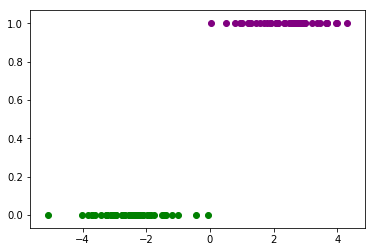

### Questions

### Objectives
YWBAT
* give 3 examples of when logistic regression is used in the real world
* explain how linear regression is tied to logistic regression
* explain the purpose of a sigmoid function

### Outline


```python
import pandas as pd
import numpy as np

from sklearn.linear_model import LogisticRegression, LogisticRegressionCV
from sklearn.metrics import confusion_matrix


import matplotlib.pyplot as plt
```

### Let's load in some mocked data


```python
df = pd.read_csv("data.csv")
x = df["x"]
y = df["y"]

color_dict = {0: 'green', 1: 'purple'}
for i, j in zip(x, y):
    plt.scatter(i, j, color=color_dict[j])
```





### How can we estimate these points?     

$$f(x)= \frac{1}{1 + e^{-c_1(x - c_2)}}$$   


```python
def sigmoid(x, c1=1, c2=0):
    return 1 / (1 + np.exp(-c1*(x - c2)))
```


```python

```

### Assessment
